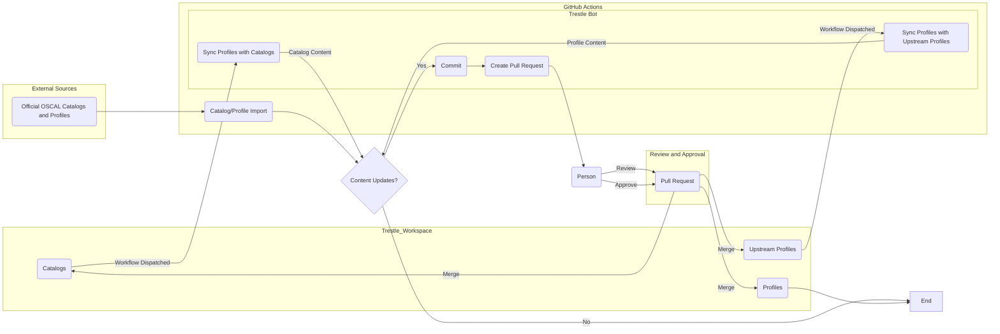

# oscal-profiles

OSCAL Custom Profiles for testing with FedRAMP REV5 HIGH baseline profile.

> WARNING: Cloud Service Model derived profiles are experimental and have not been validated. 

## Directory Structure

### Content Managed by Automation

Some the directories in this repository are managed through automated processes such as make targets or GitHub Actions.

- catalogs: This stores OSCAL Catalogs installed in the trestle workspace.
- profiles (FedRAMP only) - This stores OSCAL Profiles installed in the trestle workspace.

For information on how this data is managed, see the [FAQs](./docs/faqs.md).

### Content Managed by Control Owner (i.e. managed directly in this repository)
- markdown - This stores profile information that can be edited directly.
- profiles - This stores custom OSCAL Profile JSON installed in the trestle workspace.
- scripts - This stores bash scripts for automation tasks unique to this repository.

## Workflow

The below diagram depict the event-driven pull-based strategy used to update the content in this repository.

### Current Limitations:

- Catalogs and profiles currently have to be synced by manually executing a GitHub Action workflow.

To complete work from a fork, local automation is available. To see the available make targets, use `make help`. For information on how to edit the content in this repository, see the [tutorial](./docs/tutorial.md).
