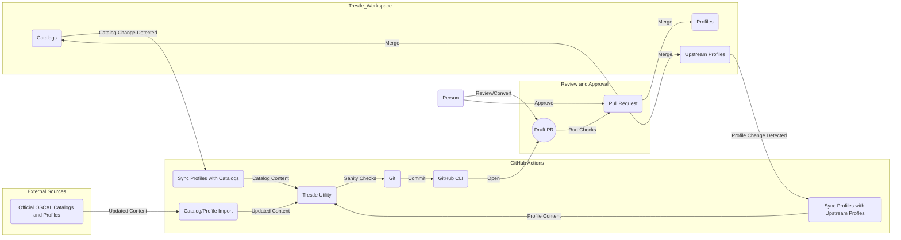

# oscal-profiles

OSCAL Custom Profiles for testing with FedRAMP HIGH baseline profile.

> IMPORTANT: The FedRAMP Rev5 Baseline OSCAL documents have not been merged at the time this was written. The profile used in this repository is from this [pull request](https://github.com/GSA/fedramp-automation/pull/389) and has been converted to JSON.

## Directory Structure

### Content Managed by Automation

Some the directories in this repository are managed through automated processes such as make targets or GitHub Actions.

- catalogs: This stores OSCAL Catalogs installed in the trestle workspace.
- profiles (FedRAMP only) - This stores OSCAL Profiles installed in the trestle workspace.
- vendor - This stores automation managed in a central repository that is vendored in.

For information on how this data is managed, see the [FAQs](./docs/faqs.md).

### Content Managed by Control Owner (i.e. managed directly in this repository)
- markdown - This stores profile information that can be edited directly.
- profiles - This stores custom OSCAL Profile JSON installed in the trestle workspace.
- scripts - This stores bash scripts for automation tasks unique to this repository.

## Workflow

The below diagram depict the event-driven pull-based strategy used to update the content in this repository.

### Current Limitations:

1. Catalogs and profiles currently have to be synced by manually executing a GitHub Action workflow.
2. Content must be assembled using the provided commands. Tasks are run when pull requests are submitted to check whether content is valid and in sync.
3. The FedRAMP workflow imports the Rev4 baselines currently. This will be updated once the Rev5 baselines are available.

To see the available make targets, use `make help`. For information on how to edit the content in this repository, see the [tutorial](./docs/tutorial.md).
